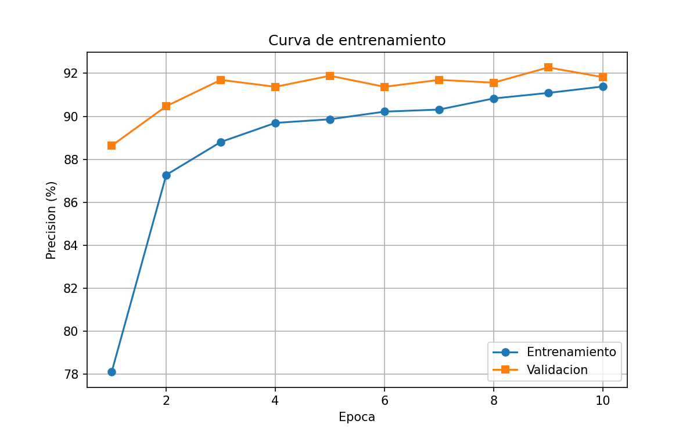

  

# Clasificador de Residuos con Transfer Learning

Clasificador de imagenes entrenado con Transfer Learning sobre ResNet-18, aplicado a la clasificacion automatica de residuos en 13 categorias. Alcanza un 95.6% de precision en validacion e incluye deteccion de imagenes no relacionadas con residuos.

## Que resuelve

La clasificacion manual de residuos es lenta y propensa a errores. Este modelo identifica automaticamente el tipo de residuo a partir de una imagen, con aplicacion directa en plantas de reciclaje, apps moviles o sistemas de vision industrial.

## Resultados

Precision entrenamiento: 95.4%
Precision validacion: 95.6%
Epocas entrenadas: 10
Imagenes totales: 23,636 entrenamiento — 5,913 validacion
Clases: 13

## Clases detectadas

battery: Pilas y baterias
biological: Residuos biologicos
brown-glass: Vidrio cafe
cardboard: Carton
clothes: Ropa y textiles
green-glass: Vidrio verde
metal: Metal
paper: Papel
plastic: Plastico
shoes: Calzado
trash: Basura general
unknown: Imagen no reconocida como residuo
white-glass: Vidrio blanco

## Ejemplos de uso

Comando: `python app.py data/val/plastic/plastic10.jpg`

Imagen:        data/val/plastic/plastic10.jpg
Clasificacion: PLASTIC
Confianza:     94.3%

Top 3:
  plastic         -> 94.3%
  white-glass     -> 5.0%
  metal           -> 0.6%

Comando: 'python app.py ruta/imagen_no_residuo.jpg'

Imagen:        ruta/imagen_no_residuo.jpg
Clasificacion: UNKNOWN
Confianza:     89.2%

Top 3:
  unknown         -> 89.2%
  trash           -> 6.4%
  biological      -> 2.1%

## Aplicacion web

La aplicacion web con frontend React y API FastAPI esta disponible en: https://github.com/pablojimenez23/clasificador-app

Permite clasificar residuos desde el navegador subiendo una imagen directamente, sin instalar nada localmente.

## Instalacion

Clone el repositorio con: 'git clone https://github.com/pablojimenez23/clasificador-imagenes.git'

Ingrese a la carpeta con: 'cd clasificador-imagenes'

Instale las dependencias con: 'pip install -r requirements.txt'

Configura su token de Kaggle en: '~/.kaggle/kaggle.json':

{
  "username": "tu_usuario_kaggle",
  "key": "tu_token_kaggle"
}

Descargue y organize los datasets con:

- kaggle datasets download -d mostafaabla/garbage-classification
- kaggle datasets download -d puneet6060/intel-image-classification
- python -c "import zipfile; zipfile.ZipFile('garbage-classification.zip').extractall('data_raw')"
- python -c "import zipfile; zipfile.ZipFile('intel-image-classification.zip').extractall('data_raw_unknown')"
- python organizar_datos.py
- python organizar_unknown.py

Entrene el modelo con: 'python train.py'

Clasifique una imagen con: 'python app.py ruta/imagen.jpg'

## Tecnologias

Python 3.12 — PyTorch 2.0 — TorchVision — ResNet-18 — Matplotlib — Pillow — Kaggle — Google Colab

## Proximas mejoras

Autenticacion con JWT en la API
Despliegue en AWS EC2 con Docker
Soporte para video en tiempo real
Aplicacion movil con React Native

## Como contribuir

Haga fork del repositorio, crea una rama con: 'git checkout -b feature/nombre-mejora', realize sus cambios y abra un Pull Request describiendo lo que realizo.

---

## Autor

Pablo Jimenez — Ingeniero en Informatica
GitHub: https://github.com/pablojimenez23